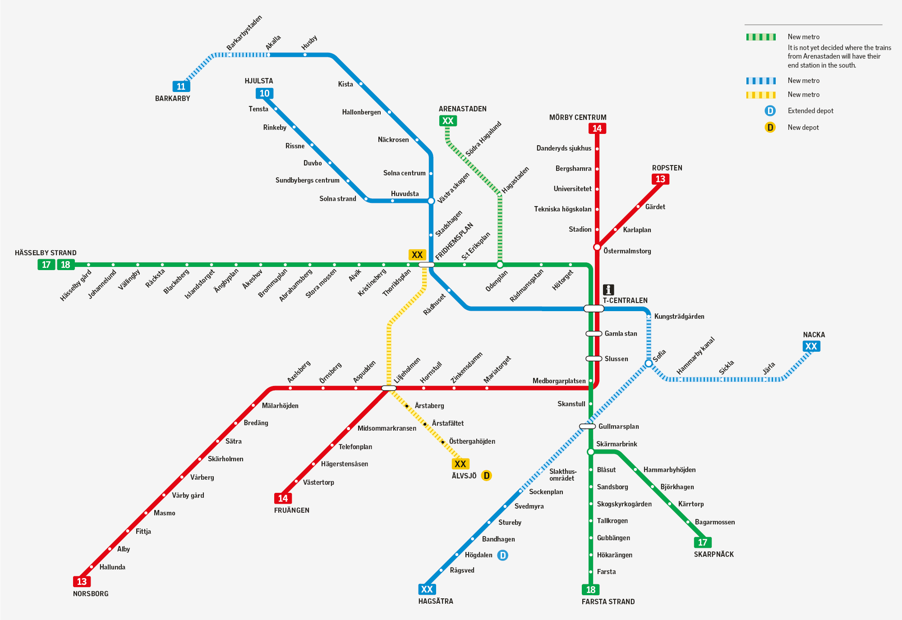

# Stockholm Metro Guide

The idea of morph transition between geographic and schematic subways is not a new one, yet I didn’t see a working guides or nicely designed animations on this topic. That’s way I started making this series of metro animations. 

If you want to read more of my thoughts and plans on this topic, you can expand Thoughts section, otherwise go straight to the tutorial

This approach is not the best and I think not fully optimized but it is working one. As I make more cities I encounter new challenges and change my approach. So far, this tutorial I am writing after compliting Berlin metro, but later the workflow might change. Read with skepticism

## 1. Data collection

1. Get the schematic map of Stockholm metro

First thing I did was to google Stockholm metro map and took the first one I saw. Later, I found out it is a future plan of metro, not current. But I found it out when I already published my animation. So, try to make sure that you are using the right scheme.



1. Download geographic data for subway lines and stations

For subway dataset, I usually use OSM data, but sometimes local government has official datasets which are more organised and complete.

In this case, I downloaded data from Geofabrik distributer, but you can get it anywhere you feel comfortable. Options are:

- https://download.geofabrik.de/europe/sweden.html
- https://download.bbbike.org/osm/bbbike/Stockholm/

I prefer to work with gpkg format.

For complete newbies:

Next step we need to upload our gpkg to QGIS and choose railways and transport:


Then Filter our data using these queries

For railway layer:

```sql
"fclass" = 'subway'
```

For transport layer (our stations):

```sql
"fclass" = 'railway_station'
```


## 2. Stations

1. Create line field and fill it

Now we need to create two additional fields in transport layer which are metro lines and sublines. This is quite specific, usually, there should be just metro line, but since in Stockholm metro, subway branches are splitted in colors and inside colors they are splitted by numbers, so we need to create cline (color line) and nline (number line)


1. Create order per line

Now, within cline and nline, we need to number station by order. In this case it doesn’t matter where to start: from northern station or southern. What matters is later we need to start drawing schemtatic lines in Fimga (or any other vector software) following the same order. I usually start with North or west side.


## 3. Lines

1. Points to path

So, now we can use the fields that we created in previous step to build a single line through the stations. In QGIS, tool called points to path will help us. After running the tool, we will have single lines, but some of them will not be connected because for example blue line on north, 10 and 11 will be separate. In this case we just connect them manually.


1. Digitizing approximately

Now, we need to modify our generated string using the railway lines from OSM. Digitization can be approximate.


## 4. Layout

1. Projection

For this case I stayed with original projection (right) which is WGS84, but it also works with UTM (left); the visualization just looks different


1. Export

For export, I used custom page properties — 1080 by 1350, for social media posts. Then export as svg


## 5. Schematic metro

1. Drawing schematic

After QGIS, I import my materials into Figma. I create 2 pages 1080 by 1350, then place the earlier schematic image I downloaded and start tracing the lines the same order I numbered my stations.

After I just smooth the edges by applying corner radius in Figma


1. Stations

After lines, I start placing stations. Usually I take the exported canvas from QGIS and place it on top of the schematic and then just move stations to its schematic version

1. Export

Then I just add Labels of line number to both geographic and schematic. After this, I export them as svg.

# 6. Download the project from GitHub

## Prerequisites

Install these first, all one-time:

| Tool | Why | Check |
| --- | --- | --- |
| [Git](https://git-scm.com/downloads) | clone the project | `git --version` |
| [Node.js](https://nodejs.org/) 18+ | runs the capture script | `node --version` |
| [pnpm](https://pnpm.io/installation) | installs dependencies | `pnpm --version` |
| [ffmpeg](https://ffmpeg.org/download.html) | turns frames into mp4/gif | `ffmpeg -version` |

Windows: `winget install Gyan.FFmpeg`. macOS: `brew install ffmpeg`. Reopen your terminal afterward so `ffmpeg` is on PATH.

## Clone and install

```bash
git clone https://github.com/RassCrom/morph-metro/tree/feature/draw-animation
cd morph-metro
pnpm install
```

`pnpm install` pulls Puppeteer, which downloads its own Chromium (~150 MB). If Chrome is already installed on your machine, the script uses that instead.

## What's in the folder

```
morph-metro/
├── metro-morph.html   the animation and all its settings — the only file you edit
├── capture.js          renders the animation to PNG frames, then to mp4/gif
├── stock-geo.svg       example pair: geographic
├── stock-schem.svg     example pair: schematic
└── package.json
```

Drop your own two SVGs from chapter 5 into this same folder, next to the Stockholm pair.

# 7. Running the script

## 7.1 Preview

Do not open `metro-morph.html` by double-clicking it. Browsers block `fetch()` on `file://`, so the page can't read your SVGs. Serve the folder over HTTP instead:

```bash
pnpm dlx serve .
```

Open the address it prints and load `metro-morph.html` from there.

## 7.2 Tune it in the browser, not in the file

Add `?edit=1` to the URL:

```
<http://localhost:3000/metro-morph.html?edit=1>
```

A panel appears on the right: canvas size, timing, title text, colors, line width, station size, bloom, grain, vignette, and a scrub slider to step through the morph frame by frame. The panel only exists with `?edit=1`, so it never leaks into a captured frame.

Adjust until it looks right, hit **Copy config**, and paste the copied block over the `CONFIG` object at the top of `metro-morph.html`.

You can also override values straight from the URL, without touching the file:

```
?canvas=9:16&theme=light&labels=0&morph=1800
```

## 7.3 The settings that matter most

Everything lives in the `CONFIG` block at the top of `metro-morph.html`. What you'll change per city:

```jsx
sources: {
  geographic: "berlin-geo.svg",
  schematic:  "berlin-schem.svg",
},

canvas: "source",   // "source" | "4:5" | "9:16" | "1:1" | "16:9" | {width, height}

timing: {
  morph: 2400,      // geographic → schematic, ms
  hold:  800,       // pause at each end
  intro: 1200,      // one-time draw-on lead-in; 0 = off
  loop: "pingpong", // "pingpong" = morph out and back
                     // "forward"  = morph out, then crossfade back
  dissolve: 600,    // "forward" only
},

title: {
  main:    "Berlin metro network",
  left:    "GEOGRAPHIC",
  divider: "VS",
  right:   "SCHEMATIC",
  credit:  "Made by Alikhan Beisenbayev · © OpenStreetMap contributors",
},

theme: "dark",      // "dark" | "light"
labels: true,
```

Two things worth knowing: `intro` breaks a perfect loop on purpose, since the lead-in plays once before the cycle starts — set `intro: 0` for a file that loops seamlessly on Instagram or TikTok. And the engine auto-detects which strokes are metro lines, which are rivers, and which lines run backward in the schematic, printing what it found to the browser console — open DevTools on your first run and check it before touching the `detect` block.

## 7.4 Render the frames

```bash
pnpm render
```

That runs `node capture.js --mp4 output.mp4`: a tiny local server, headless Chrome at the exact canvas size, one screenshot per frame into `frames/`, then ffmpeg. With the default Berlin settings you get 456 PNGs and an `output.mp4`.

For anything beyond the default, call `capture.js` directly:

```bash
node capture.js --canvas 9:16 --fps 60 --loops 2 --mp4 reels.mp4
```

| Flag | Default | What it does |
| --- | --- | --- |
| `--page` | `metro-morph.html` | which file to capture |
| `--fps` | `60` | frames per second |
| `--loops` | `1` | how many full cycles to record |
| `--out` | `frames` | frame output folder |
| `--query` | — | extra URL params, e.g. `--query "canvas=9:16&theme=light"` |
| `--mp4` | — | run ffmpeg and write an mp4 |
| `--gif` | — | run ffmpeg and write a gif (two-pass palette) |
| `--gif-fps` | `--fps` | downsample the gif |
| `--gif-width` | full size | downscale the gif, aspect preserved |

Leave `--mp4` off and the script prints the ffmpeg command instead of running it, so you can tweak the encode yourself. For a gif, let the script handle it: it runs a two-pass palette (`palettegen` + `paletteuse`), because a plain one-pass encode bands the gradient background and the bloom halo.

```bash
node capture.js --gif output.gif --gif-fps 15 --gif-width 720
```

## Attribution and rights

Station and line geometry traced from OpenStreetMap needs an "© OpenStreetMap contributors" credit in the output (see `title.credit` above). If your schematic source is an official transit authority diagram, check its license before publishing — tracing it in Figma makes a derivative work, and "personal social post" doesn't clear that on its own. See [README.md](https://app.notion.com/p/karasugis/README.md#attribution-and-rights) for the full note.